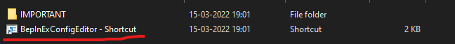
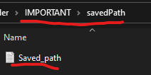
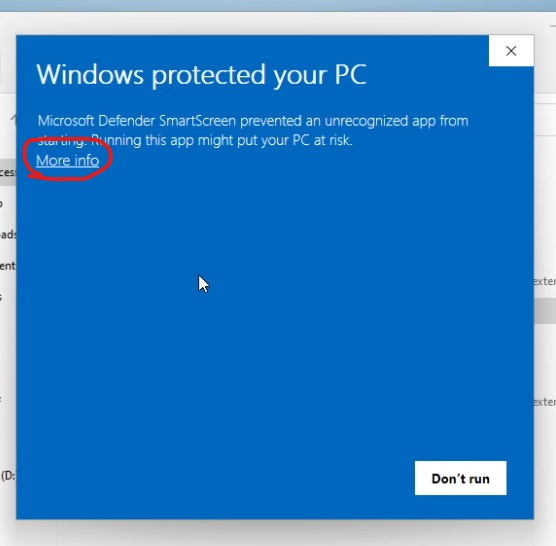
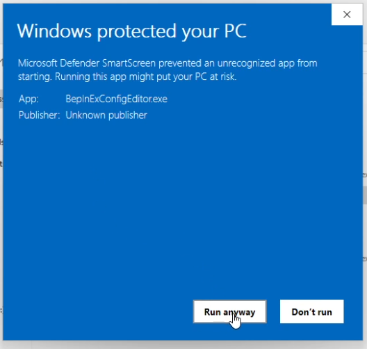
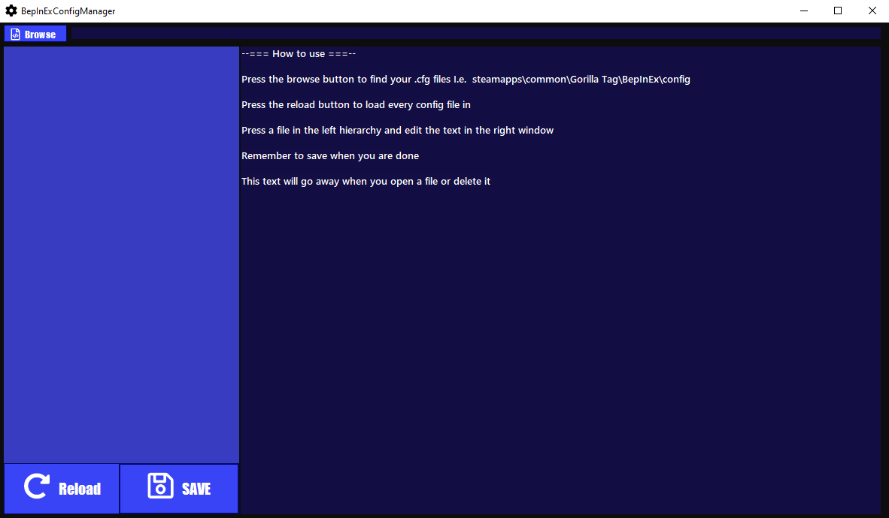

# Install

First you need to install .Net Runtime from [here](https://dotnet.microsoft.com/en-us/download/dotnet/6.0/runtime "Microsoft .Net runtime downloads")

After that you need to delete the shortcut that comes inside the downloaded configManager folder. (optional)

Open the "IMPORTANT" folder and open the "savedPath" folder. Then open the "Saved_path.txt" file and delete the content inside.

After that you can type in a path yourself or go back to the "IMPORTANT" folder and run the exe

When opening the application you should be greeded with a windows warning like this

Click more options and click run anyways to get the application to work

Now you are all set. If you didn't paste a path to the txt file you can make the app apply one by using the "Browse" button

# DEVS

##BepInEx

For making a .cfg with bepinex you need to do something like [this](https://github.com/jona939s/Trail-monkey/blob/main/Class1.cs)

## other applications

Make a file ending in .cfg and this application will be able to edit it 
