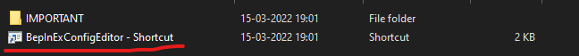
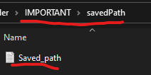
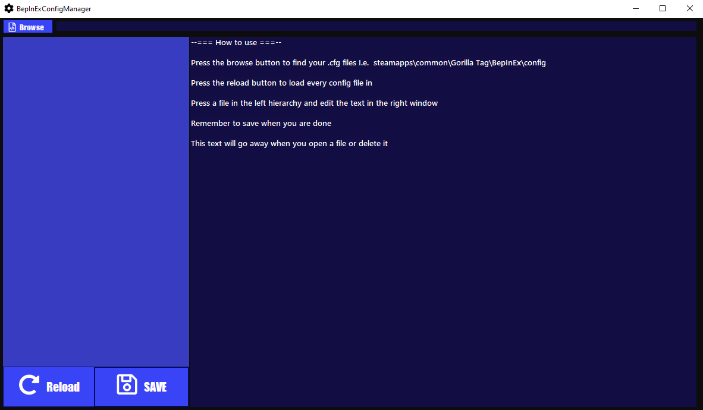

# Install

Start by placing the shortcut for the downloaded file somewhere easy to find. After that you can place the downloaded file somewhere else (if you would like to)

After that you can add a path to the folder with all the .cfg files. This can be done in this file under IMPORTANT\savedPath\Saved_path.txt

Or you can open the application and use the browse button to find it. This path will be saved in the same place. The application also documents how to use it

# DEVS

##BepInEx

For making a .cfg with bepinex you need to do something like [this](https://github.com/jona939s/Trail-monkey/blob/main/Class1.cs)

## other applications

Make a file ending in .cfg and this application will be able to edit it 
