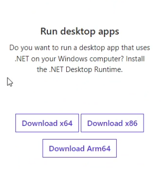

# Might not work with windows 11 right now, not sure

# Install

First you need to install .Net Runtime from [here](https://dotnet.microsoft.com/en-us/download/dotnet/6.0/runtime "Microsoft .Net runtime downloads")

# DEVS

##BepInEx

For making a .cfg with bepinex you need to do something like [this](https://github.com/jona939s/Trail-monkey/blob/main/Class1.cs)

## other applications

Make a file ending in .cfg and this application will be able to edit it 
